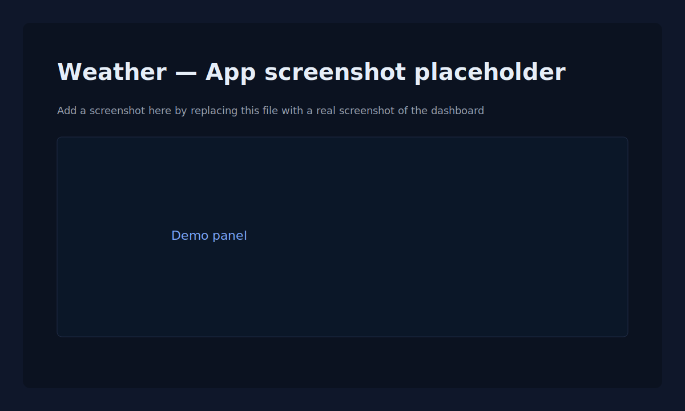

# اپ هوا — داشبورد مدرن چندزبانه‌ی آب و هوا

[](https://chimerical-marshmallow-6f8276.netlify.app/) [](https://github.com/Besmillah-Azimi/weather-app) [](LICENSE)

یک اپلیکیشن زیبا، واکنش‌گرا و چندزبانه برای نمایش وضعیت آب و هوا که با React و Vite ساخته شده است. این اپ شرایط فعلی، پیش‌بینی ساعتی و روزانه را همراه با انیمیشن‌ها و آیکون‌های زیبا نمایش می‌دهد.

**ویژگی‌ها:**

- ⚡ سریع و سبک با Vite
- 🌍 پشتیبانی از چندین زبان (i18n) — فایل‌های زبان از قبل موجودند
- ✨ رابط کاربری زیبا با Tailwind CSS و انیمیشن‌ها (GSAP، Framer Motion)
- 📱 واکنش‌گرایی مناسب برای موبایل و دسکتاپ

---

**نمایش محلی:** پیش‌نمایش آنلاین: https://chimerical-marshmallow-6f8276.netlify.app/ — برای مشاهده اپ به صورت محلی طبق دستورالعمل زیر عمل کنید.

---

## امکانات

- نمایش وضعیت فعلی هوا (دمای فعلی، شرایط، باد، فشار و ...)
- نمایش ساعتی و هفت‌روزه
- نمایش نام کشورها به زبان انتخاب‌شده
- تغییر خودکار تم و انیمیشن‌ها بر اساس زمان روز و شرایط آب و هوا
- امکان تغییر زبان از داخل رابط کاربری

## فهرست مطالب

- [پیش‌نمایش](#پیش-نمایش)
- [امکانات](#امکانات)
- [تکنولوژی‌ها](#تکنولوژی‌ها)
- [راه‌اندازی سریع](#راه-اندازی-سریع)
- [متغیرهای محیطی](#متغیرهای-محیطی)
- [چندزبانه‌سازی](#چندزبانه‌سازی)
- [نکات و سفارشی‌سازی](#نکات-و-سفارشی-سازی)
- [مشارکت](#مشارکت)
- [لایسنس](#لایسنس)

## تصویر صفحه

<p align="center">
   
</p>

## تکنولوژی‌ها

- React
- Vite
- Tailwind CSS
- react-i18next
- Axios
- GSAP و Framer Motion
- OpenWeatherMap API

## راه‌اندازی سریع

1. کلون کنید:

   git clone https://github.com/Besmillah-Azimi/weather-app.git
   cd weather

2. نصب وابستگی‌ها:

   npm install

3. تنظیم کلید OpenWeatherMap

برای امنیت و جلوگیری از انتشار کلید در مخزن، از یک متغیر محیطی استفاده کنید:

```sh
VITE_OPENWEATHER_API_KEY=your_openweather_api_key
```

برای خواندن کلید از متغیر محیطی، مقدار زیر را در `src/hooks/UseWeather.jsx` قرار دهید:

```js
const API_KEY = import.meta.env.VITE_OPENWEATHER_API_KEY;
```

4. اجرای برنامه در حالت توسعه:

   npm run dev

5. ساخت برای تولید:

   npm run build

6. پیش‌نمایش نسخه‌ی ساخته‌شده:

   npm run preview

## چندزبانه‌سازی

- فایل‌های زبان در `src/locales` قرار دارند.
- برای اضافه‌کردن زبان جدید، یک فایل JSON در `src/locales` بسازید و آن را در `src/i18n.js` و لیست زبان‌ها در `src/hooks/UseLanguage.jsx` ثبت کنید.

## ساختار پروژه (فایل‌های مهم)

- `src/App.jsx`: نقطه ورود اپ و مدیریت پنل‌ها
- `src/hooks/UseWeather.jsx`: سرویس دریافت اطلاعات آب و هوا (تعویض کلید API توصیه می‌شود)
- `src/hooks/UseLanguage.jsx`: مدیریت زبان‌ها
- `src/components`: مؤلفه‌ها و ویجت‌های رابط کاربری

## نکات و سفارشی‌سازی

- حتماً کلید API را از داخل کد حذف کرده و از متغیر محیطی استفاده کنید.
- تصاویر آیکون‌ها در `public/icons/weather` قرار دارند؛ برای تغییر آیکون‌ها از آنجا استفاده کنید.
- برای افزودن انیمیشن یا منطق جدید، `WeatherReducer` را گسترش دهید.

## تماس

- برای ارتباط یا گزارش باگ، یک issue در گیت‌هاب باز کنید: https://github.com/Besmillah-Azimi/weather-app/issues

## مشارکت

مشارکت‌ها خوش‌آمد گفته می‌شوند:

1. ریپوزیتوری را فورک کنید
2. یک شاخه جدید بسازید
3. تغییرات را انجام دهید
4. درخواست pull همراه با توضیحات و اسکرین‌شات (در صورت نیاز) ارسال کنید

## لایسنس

این پروژه تحت مجوز MIT قرار دارد. در صورت نیاز آن را با لایسنس موردنظر خود جایگزین کنید.

## تقدیر و تشکر

- با تشکر از کتابخانه‌ها و افراد سازنده ابزارهای متن‌باز استفاده‌شده در این پروژه.

---

اگر تمایل دارید، می‌توانم کد را هم اصلاح کنم تا از متغیر محیطی `VITE_OPENWEATHER_API_KEY` استفاده کند. مایل هستید این کار را انجام دهم؟
